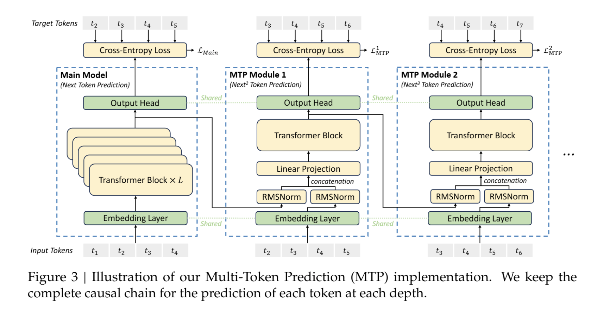
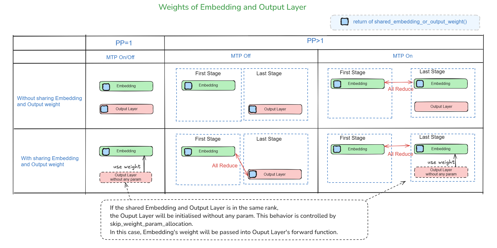
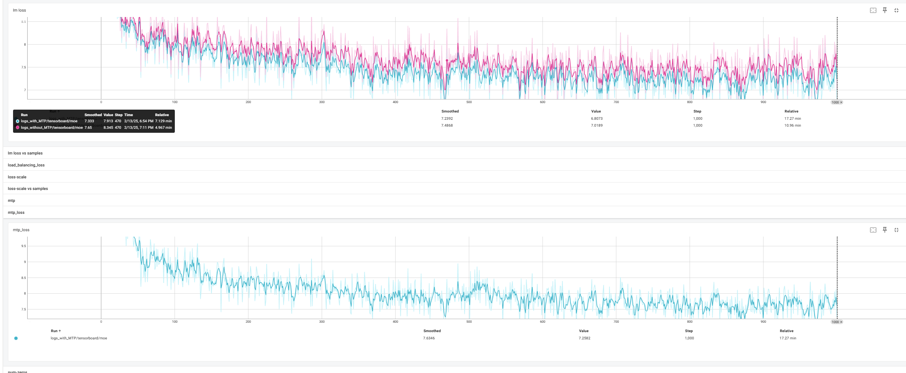
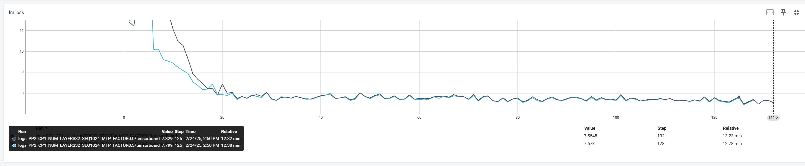

# What does this PR do ?

This PR implementates the Multi-Token Prediction (MTP) in [deepseek-ai/DeepSeek-V3](https://github.com/deepseek-ai/DeepSeek-V3), which extends the prediction scope to multiple future tokens at each position.

This MTP implementation sequentially predict additional tokens and keep the complete causal chain at each prediction depth, by using D sequential modules to predict D additional tokens. Each MTP module consists of a shared embedding layer, a projection matrix, a Transformer block, and a shared output head. For the i-th input token at the (k - 1)-th prediction depth, we first combine the representation of the i-th token and the embedding of the (i + K)-th token with the linear projection. The combined serves as the input of the Transformer block at the k-th depth to produce the output representation. For more information, please refer to [DeepSeek-V3 Technical Report](https://github.com/deepseek-ai/DeepSeek-V3/blob/main/DeepSeek_V3.pdf).

{width=&quot;678&quot; height=&quot;364&quot;}

# Usage

With this MR, we can train GPTModel with Multi-Token Prediction (MTP) by setting set mtp_num_layers to be a positive integer.

## Related Arguments

| Item | Description |
|------|-------------|
| mtp_num_layers | Number of Multi-Token Prediction (MTP) Layers. MTP extends the prediction scope to multiple future tokens at each position. This MTP implementation sequentially predict additional tokens by using D sequential modules to predict D additional tokens. Default is None. |
| mtp_loss_scaling_factor | Scaling factor of Multi-Token Prediction (MTP) loss. We compute the average of the MTP losses across all depths, and multiply it the scaling factor to obtain the overall MTP loss, which serves as an additional training objective. Default is 0.1. |

For example, if set mtp_num_layers=1 and num_layers=61, then there will be 61 layers totally in decoder block for main model, and 1 MTP layer in MTP block.

## Precautions

Please **_do not_** use **_Context Parallel (CP)_**, or arbitrary **_AttnMaskType_**, or **_learned absolute position embedding_** with Multi-Token Prediction (MTP) feature. These use cases are not yet supported in this MR.

**_Cpu offload_**, **_activation recompute_**, and **_cuda graph_** for the Multi-Token Prediction (MTP) layer are not yet supported in this MR.

# Sharing Embedding Weights

In a pipelined setup with more than one stage, if we use Multi-Token Prediction (MTP) feature we maintain a copy of input embedding at the last stage. In that case, if set sharing input embedding and output weights arg to True, output layer will skip weight param allocation and use weights stored in embedding layer.

{width=&quot;879&quot; height=&quot;438&quot;}

Theoretically, we can choose between two implementation schemes.

* Option 1 (chosen)
  * MTP embedding(LanguageModelEmbedding) allocates weight.
  * Output layer(tensor_parallel.ColumnParallelLinear) skips allocating weight
  * There is **_already a flag_** in the init fun of tensor_parallel.ColumnParallelLinear to indicate whether allocating weight.
  * There is **_already some code_** in the forword func of tensor_parallel.ColumnParallelLinear to pass the shared weight into it.
* Option 2
  * MTP embedding layer(LanguageModelEmbedding) skips allocating weight.
  * Output layer(tensor_parallel.ColumnParallelLinear) allocates weight
  * **Need to modify** the init func of LanguageModelEmbedding, in order to pass a flag to indicate whether allocating weight.
  * **Need to modify** the forward func of LanguageModelEmbedding, in order to pass the shared weight into it.

There is a common design logic for the weight sharing both with MTP and without MTP.

The common design logic is that the shared weight will be saved in embedding other than output layer.

# Param Name in HuggingFace and Mcore

The relationship of param names in [HuggingFace DeepSeek-V3 model.safetensors.index.json](https://huggingface.co/deepseek-ai/DeepSeek-V3/blob/main/model.safetensors.index.json) and MCore is shown as the following table.

|**_Param Name in HuggingFace_** | **_Param Name in Mcore_**|
|--|--|
|model.embed_tokens.weight|embedding.word_embeddings.weight|
|model.norm.weight|decoder.final_layernorm.weight|
|lm_head.weight|output_layer.weight|
|model.layers.60.self_attn.xxx|decoder.layers.60.self_attention.xxx|
|model.layers.60.mlp.xxx|decoder.layers.60.mlp.xxx|
|model.layers.61.embed_tokens.weight|embedding.word_embeddings.weight|
|model.layers.61.enorm.weight|mtp.layers.0.enorm.weight|
|model.layers.61.hnorm.weight|mtp.layers.0.hnorm.weight|
|model.layers.61.eh_proj.weight|mtp.layers.0.eh_proj.weight|
|model.layers.61.input_layernorm.weight|mtp.layers.0.tf_layer.input_layernorm.weight|
|model.layers.61.self_attn.xxx|mtp.layers.0.tf_layer.self_attention.xxx|
|model.layers.61.post_attention_layernorm.weight|mtp.layers.0.tf_layer.pre_mlp_layernorm.weight|
|model.layers.61.mlp.xxx|mtp.layers.0.tf_layer.mlp.xxx|
|model.layers.61.shared_head.norm.weight|mtp.layers.0.final_layernorm.weight|
|model.layers.61.shared_head.head.weight|output_layer.weight|

# Correctness Test

## Finetune with DeepSeek-V3

We used the DeepSeek V3 checkpoint and Slimpajama dataset downloaded from Huging Face for fine-tuning and obtained an LM loss of 1.9 and an MTP loss of 2.5 in the first step, which is generally in line with expectations.

## Pretrain with Self-defined Small Model

For the model with only 2 transformer layers, cross entropy loss decreases more quickly while training with MTP.

But for the model with 32 transformer layers, cross entropy loss remains almost the same for training with and without MTP.

So it is hard to verify the correctness of MTP only using cross entropy loss.

### loss of model with only 2 transformer layers

The red line is cross entropy loss without MTP, and the blue line is cross entropy loss with MTP.

{width=&quot;835&quot; height=&quot;344&quot;}

### loss of model with 32 transformer layers

{width=&quot;835&quot; height=&quot;344&quot;}

## 

## TODOs to support standalone stage for MTP

* Refactor of PP stage placement !2795
* Embedding initialization and grads reduce of embedding
  * Update embedding parallel group
* Dist ckpt
