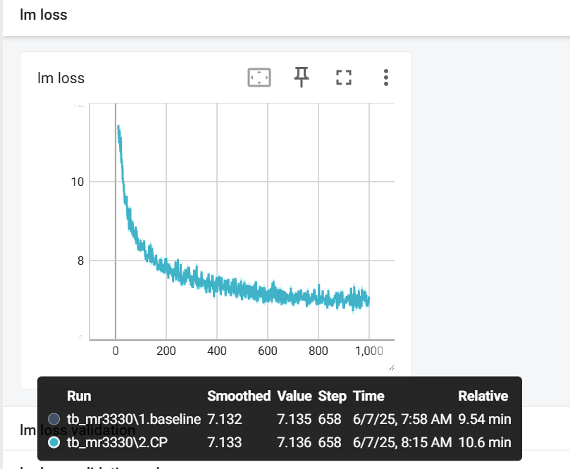
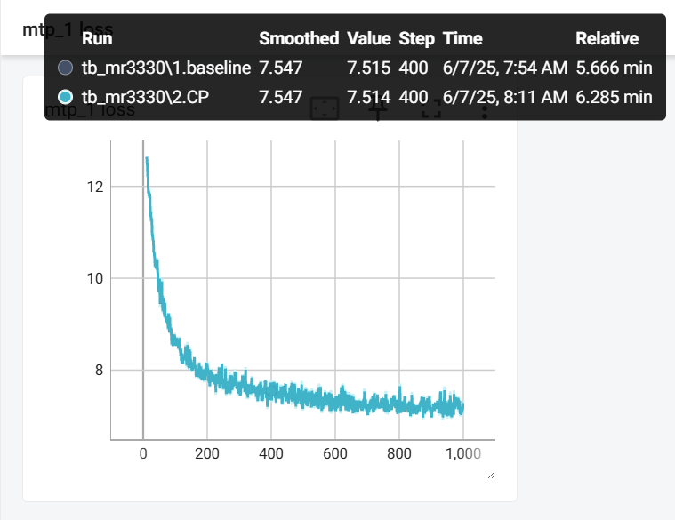

# What does this PR do ?

This PR adds Context Parallelism (CP) support to Multi-Token Prediction (MTP), enabling MTP to work efficiently with large models that use sequence-level parallelism. Previously, MTP was restricted to CP=1, which limited its applicability to large-scale training scenarios.

## Modifications

- **Enhanced tensor rolling with CP support**: Extended `roll_tensor` function to handle CP communication for proper sequence continuity across CP boundaries
- **Updated MTP block constructor**: Added CP process group initialization and validation
- **Modified forward pass**: Integrated CP-aware tensor rolling for input IDs, position IDs, labels, and loss masks
- **Removed CP restriction**: Updated argument validation to allow CP 1 for MTP
- **Enhanced loss tracking**: Added proper loss averaging across CP ranks
- **Comprehensive testing**: Extended test coverage to include various TP/CP configurations
- **Updated golden values**: Reflected performance characteristics of MTP with CP support
- **MTP Recomputation**

## MR Details

### Problems to Solve

MTP was previously restricted to CP=1, preventing its use with large models that require Context Parallelism for memory efficiency.

### Solutions

For MTP+CP, in order to make MTP access data on another CP rank, there are two main categories of solutions:

1. (Adopted in this MR) Using communication between CP ranks (this is the scheme currently used by MR) When rolling the MTP tensor, the required data is transmitted between CP ranks.

   **Disadvantage**:&nbsp;This requires triggering communication.
   To reduce the performance impact of this additional communication, possible future improvements include:
   (a) Currently, each MTP performs communication three times separately for token, label, and loss mask. This can be optimized to only communicate once by merging the three tensors to be transmitted before communication.
   (b) Overlapping this communication with computation. However, this would increase code complexity, so it is necessary to evaluate how much the communication affects performance and whether it is worth adding this complexity.
2. Preparing the data in advance during batch preparation Before splitting data for CP ranks, prepare a copy of the data for MTP in advance and pass it to the GPT model.

   **Disadvantages**:
   (a) Requires additional storage.
   (b) Requires adding new input parameters for both the GPT model and MTP forward passes, so this solution has not been adopted.

### Modifications

1. CP-Aware Tensor Rolling (`multi_token_prediction.py`)
   - **Enhanced `roll_tensor` function**: Added support for CP 1 by implementing boundary communication between adjacent CP ranks
   - **Communication pattern**: When CP 1, tensors are split into chunks, rolled locally, then boundary elements are exchanged between adjacent ranks
   - **Sequence continuity**: Ensures proper tensor shifting across CP boundaries while maintaining MTP's next-token prediction semantics
2. MTP Block Integration
   - **Constructor updates**: Added `model_comm_pgs` parameter and CP process group initialization
   - **Forward pass integration**: Applied CP-aware rolling to input IDs, position IDs, labels, and loss masks
   - **Loss averaging**: Used data parallel group with CP for proper loss computation across all ranks
3. Argument Validation (`arguments.py`)
   - **Removed CP restriction**: Eliminated the `assert args.context_parallel_size == 1` constraint
   - **Backward compatibility**: Maintained support for existing CP=1 configurations
4. Loss Tracking Enhancement (`moe_utils.py`)
   - **Additional all_reduce**: Added proper loss averaging across CP ranks to ensure consistent loss computation
5. Comprehensive Testing
   - **Extended test coverage**: Added tests for various TP/CP combinations: (1,1), (1,2), (1,4), (2,1), (2,2), (2,4), (4,1), (4,2)
   - **Model reconfiguration**: Validated checkpoint compatibility across different TP/CP settings
6. Golden Values Update
   - **Performance reflection**: Updated functional test golden values which are affected by the communication related change.

### Results

MTP now works with any CP configuration (CP=1, 2, 4, etc.), enabling its use with large models

**Note**: moe aux loss in logging file will be changed after this MR, because we introduced all_reduce for moe aux loss accross DP/CP ranks. So does for mtp loss.

# Correctness

{width=&quot;590&quot; height=&quot;485&quot;}

{width=&quot;590&quot; height=&quot;485&quot;}
