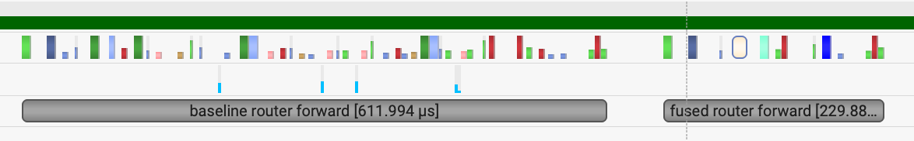
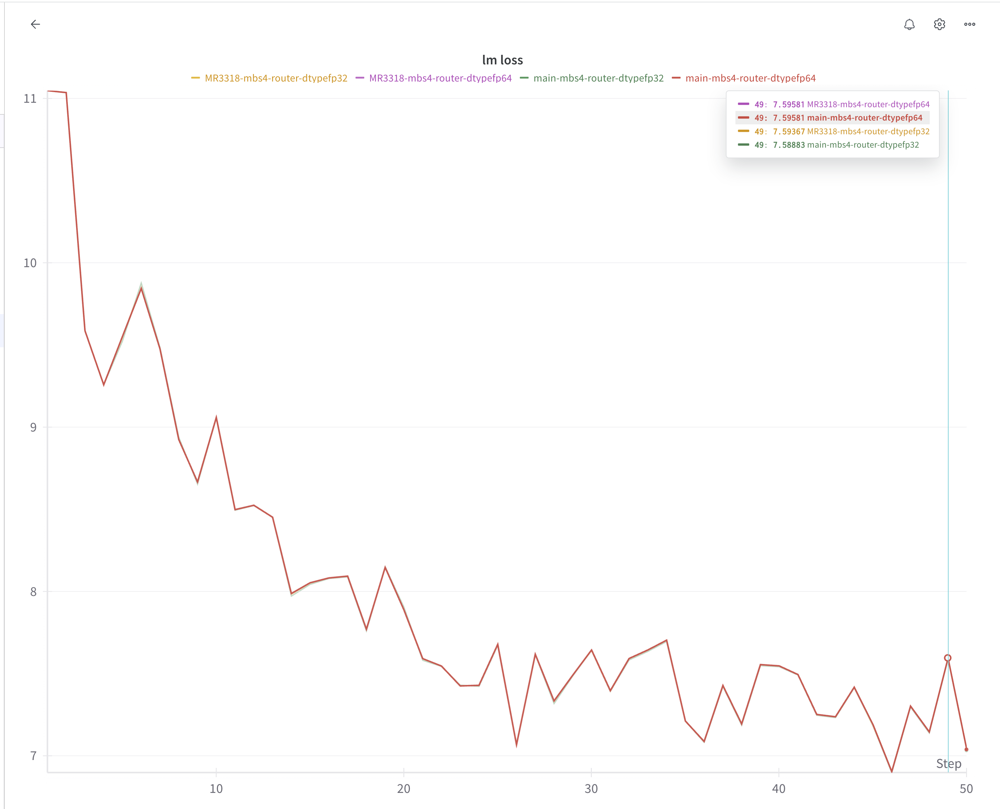

# What does this PR do ?
## Motivation

* The original router implementation had become increasingly complex with duplicated code paths for different auxiliary loss types. This refactoring improves code maintainability by unifying the auxiliary loss implementations under a common framework, making it easier to add new loss variants and experiment with different load balancing strategies.
* For latest generation GPUs like GB200, CPU overhead has become a critical bottleneck in MoE models. The router component is particularly problematic as it launches numerous small CUDA kernels for operations like top-k selection, softmax/sigmoid computation, and auxiliary loss calculation. Each kernel launch incurs CPU-side overhead from PyTorch's dispatch mechanism. By fusing these operations into optimized CUDA kernels, we eliminate redundant memory transfers and reduce kernel launch overhead, achieving better GPU utilization and overall throughput. These fused CUDA kernel has been merged in to TE https://github.com/NVIDIA/TransformerEngine/pull/1883


## Implementation
### Router Refactoring
1. Support combination of different auxiliary losses: The router now supports multiple auxiliary loss types simultaneously through list-based configuration. You can enable `aux_loss`, `seq_aux_loss` together by passing them as a list to `--moe-router-load-balancing-type`. This can make it easier to add other aux loss variants like global aux loss and flexible experiments with combinations of different aux losses.

2. Unified auxiliary loss implementation:
    * Previously, each auxiliary loss type had separate implementations with duplicated code
    * Now unified under a common framework with shared helper functions (`_apply_aux_loss`, `_apply_seq_aux_loss`)
    * Both `aux_loss` and `seq_aux_loss` now use the same `switch_load_balancing_loss_func` with different token grouping strategies
    * Auxiliary loss coefficients can be specified per loss type when using multiple losses

3. Clearer routing workflow: The TopKRouter workflow is now explicitly documented:
    * Step 1: Calculate logits via router gating network
    * Step 2: Calculate routing probabilities and map using score function (softmax/sigmoid)
    * Step 3: [Optional] Apply token dropping for capacity management
    * Step 4: [Optional] Apply auxiliary load balancing losses

4. Improved auxiliary loss calculation:
    * Added support for distributed training with proper reduction across tensor/context parallel groups
    * Auxiliary loss now correctly handles global batch statistics for better load balancing
    * Formula: `loss = E * Σ(f_i * P_i)` where f_i is token fraction and P_i is probability allocation


### Router Fusion
To reduce CPU overhead and kernel launch latency on modern GPUs, three CUDA kernels have been implemented in TransformerEngine (TE >= 2.6.0):

1. `fused_topk_with_score_function`: Fuses the top-k selection with score function computation
    * Combines softmax/sigmoid score calculation with top-k selection in a single kernel
    * Supports pre-softmax, group-based routing, and scaling factors
    * Eliminates intermediate tensor materialization

2. `fused_compute_score_for_moe_aux_loss`: Optimized score computation for auxiliary loss
    * Fuses score normalization (softmax/sigmoid) with top-k mask generation
    * Outputs both normalized scores and routing map for loss calculation

3. `fused_moe_aux_loss`: Fused auxiliary loss computation
    * Combines the entire auxiliary loss calculation into a single kernel
    * Directly computes: `loss = E * coeff * Σ(P_i * f_i) / (topk * T^2)`
    * Avoids multiple reduction operations and intermediate storage

### Configuration and Usage

* Enable router fusion: Add `--moe-router-fusion` flag or set `moe_router_fusion=True` in TransformerConfig
* Multiple auxiliary losses: Use `--moe-router-load-balancing-type aux_loss seq_aux_loss` with corresponding coefficients `--moe-aux-loss-coeff 0.01 0.001`
* Compatibility: Router fusion requires TransformerEngine >= 2.6.0 with CUDA support


## Results

### Performance
* Micro benchmark:
    * ~3x speedup on forward
    * ~1.5x speedup on backward


* E2E performance
    * 530 TFLOPS -> 540 TFLOPS in DSv3 GB200 training workloads.

### Convergence

## Reason for golden values changes in seq_aux_loss
For sequence-aux-loss, previous implementation used a `mean-sum-mean` calculation flow.
```python
cost_coeff = routing_map.sum(dim=0, dtype=torch.float).div_(seq_length * topk / num_experts)
seq_aux_loss = (cost_coeff * probs_for_aux_loss.mean(dim=0)).sum(dim=1).mean()
seq_aux_loss *= moe_aux_loss_coeff
```

In the new implementation, we unify the calculation of seq_aux_loss and aux_loss, which uses a single sum followed by a division, this can reduce total number of kernels:
```python
aggregated_probs_per_expert = probs.sum(dim=0)
aux_loss = torch.sum(aggregated_probs_per_expert * tokens_per_expert) * (
    num_experts * moe_aux_loss_coeff / (topk * total_num_tokens * total_num_tokens)
)
return aux_loss
```

This change will cause diff in the order of float data operation. For fp32, it will cause small diff in lm loss < 0.01. And for fp64, we can achieve bit-wise alignment.